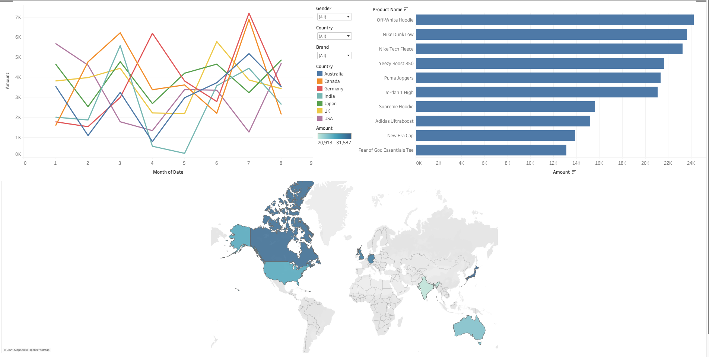

# Sneaker Sales Dashboard (2022)

A personal data analysis and visualization project using Tableau to explore 2022 sneaker and streetwear sales trends.

## What I Did

- Cleaned and prepped the raw sales data using Python (Pandas)
- Built an interactive Tableau dashboard with filters for brand, gender, and country
- Uncovered insights about popular brands, purchase behavior, and regional sales

## Dashboard Preview

[Click to watch dashboard demo](https://youtu.be/-rcbAcsf_PQ)  <!-- optional -->

## Tools Used

- Python (Pandas, Jupyter)
- Tableau Desktop
- Git + GitHub

## Files

- `notebooks/clean_and_explore.ipynb`: Data cleaning and exploration
- `tableau/dashboard.twb`: Tableau dashboard source file
- `data/sneakers_streetwear_sales_data.csv`: Original datas